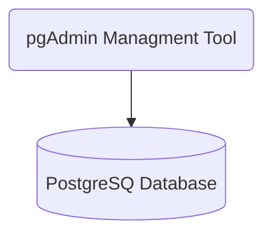

# Container Application

This repository contains a simple containerised application. The goal is to give you a minimal example for working with a [Relational Database (PostgreSQL)](https://learn.microsoft.com/en-us/aspnet/core/introduction-to-aspnet-core?view=aspnetcore-8.0) and a [Database Management Tool (pgAdmin)](https://www.postgresql.org/).

## Content

- [Application Components](#application-components)
- [Run Locally](#run-locally)
- [Technologies](#technologies)

## Application Components



## Run Locally

> [!IMPORTANT]
> This repository makes use of container technologies and
> single node container orchestration. Requisites are:
>
> - **MacOS:** [Orbstack](https://orbstack.dev/)
> - **Windows:** [Docker Desktop](https://docs.docker.com/desktop/install/windows-install/)
> - **Linux:**
>   - [Docker](https://docs.docker.com/desktop/install/linux/)
>   - [Podman](https://podman.io/docs/installation#installing-on-linux)

1. Make a copy of the repository on your machine

   ```sh
   git clone https://github.com/LarsGJobloop/kodehode-2024-08-container-application
   ```

2. Start the application stack

   ```sh
   docker compose up
   ```

3. Access pgAdmin on [http://localhost:8080](http://localhost:8080)

   - username: `admin@admin.com`
   - password: `admin`

4. Connect the database from pgAdmin
   1. Quick **Links > Add New Server**
   2. Set **General > Name** to `app-db`
   3. Set **Connection > Host Name/address** to `database`
   4. Save the configuration

This will spin up the PostgreSQL database, and pgAdmin. Which are reachable through:

- Database: [http://localhost:5432](http://localhost:5432)
- Admin Tool: [http://localhost:8080](http://localhost:8080)

## Technologies

- [Postgresql](https://www.postgresql.org/) - Relational database used in the example.
- [pgAdmin](https://www.pgadmin.org/) - Database management tool for administering PostgreSQL databases.

- [Container Technology (Docker)](https://docs.docker.com/get-started/docker-overview/) - Containerization platform to run the application.
- [Container Image Registry (Docker Hub)](https://hub.docker.com/) - Container image index
- [Container Orchestration (Docker Compose)](https://docs.docker.com/compose/)- Tool for defining and running multi-container applications.

> [!IMPORTANT]
> This repository makes use of [Nix](https://nixos.org/) to handle development
> system dependencies. If you are not using Nix, you can safely ignore these files:
>
> - `.envrc`
> - `flake.lock`
> - `flake.nix`

- [Nix](https://nixos.org/) - A tool for reproducible builds and environment management.
- [Direnv](https://direnv.net/) - A tool to load environment variables automatically.
